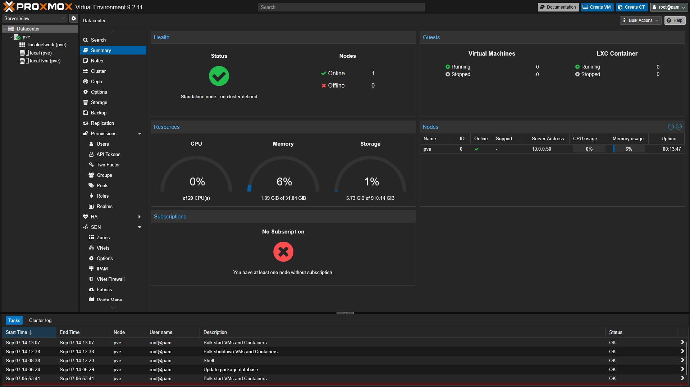
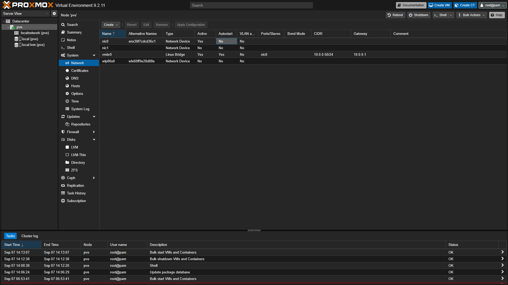

# Phase 1 — Virtualization

## Overview

The first phase of the home lab project establishes the virtualization
platform that will host the lab's virtual machines and services.

Proxmox VE was installed directly on the server as a bare-metal
hypervisor, allowing virtual machines and containers to be centrally
created, managed, and monitored.

---

## Proxmox VE Installation

Proxmox VE 9 was installed as the primary operating environment for
the home lab server.

The installation was configured with:

| Setting              | Configuration  |
| -------------------- | -------------- |
| Hypervisor           | Proxmox VE 9   |
| Node Name            | `pve`          |
| Management IP        | `10.0.0.50/24` |
| Gateway              | `10.0.0.1`     |
| Management Interface | `vmbr0`        |
| Physical Interface   | `nic0`         |

After installation, the Proxmox web interface was successfully accessed
from another computer on the local network.

---

## Package Repository Configuration

Because this server is being used as a non-production home lab, the
subscription-only Proxmox Enterprise repositories were disabled.

The `pve-no-subscription` repository was enabled instead, allowing the
system to receive Proxmox VE package updates without an enterprise
subscription.

After configuring the repositories, the host was fully updated and
rebooted to activate the updated kernel.

---

## Host Networking

The Proxmox host is connected to the local network through its physical
Ethernet interface (`nic0`). Proxmox uses a Linux bridge (`vmbr0`) for
management connectivity and future virtual machine and container
networking.

### Network Configuration

| Setting              | Value          |
| -------------------- | -------------- |
| Hostname             | `pve`          |
| Management Interface | `vmbr0`        |
| Physical Interface   | `nic0`         |
| IPv4 Address         | `10.0.0.50/24` |
| Default Gateway      | `10.0.0.1`     |
| Connection           | Ethernet       |
| Address Assignment   | Static         |
| DHCP Reservation     | `10.0.0.50`    |

The physical Ethernet interface `nic0` is attached to the `vmbr0` Linux
bridge. The Proxmox management interface is assigned the static address
`10.0.0.50/24`.

A DHCP reservation for `10.0.0.50` was configured on the network gateway
to ensure the management address remains associated with the Proxmox
host and is not assigned to another device.

### Network Verification

The network configuration was verified by:

- Confirming `vmbr0` is active and attached to `nic0`
- Confirming the Proxmox host is reachable at `10.0.0.50`
- Confirming the default gateway is `10.0.0.1`
- Reserving `10.0.0.50` for the Proxmox host on the network gateway
- Successfully accessing the Proxmox web interface from another
  computer on the LAN

---

## Current Progress

- [x] Install Proxmox VE
- [x] Configure package repositories and update host
- [x] Configure host networking
- [ ] Configure storage
- [ ] Configure remote administration
