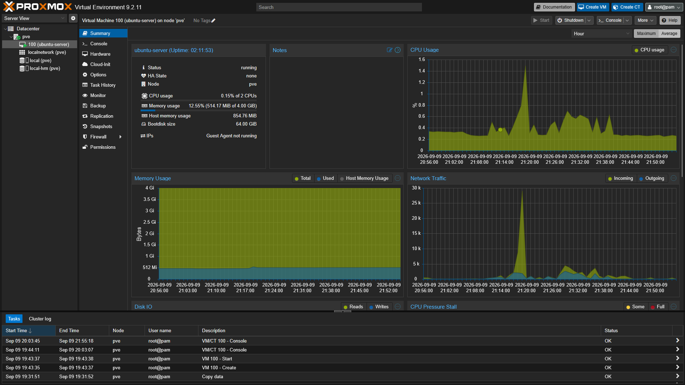
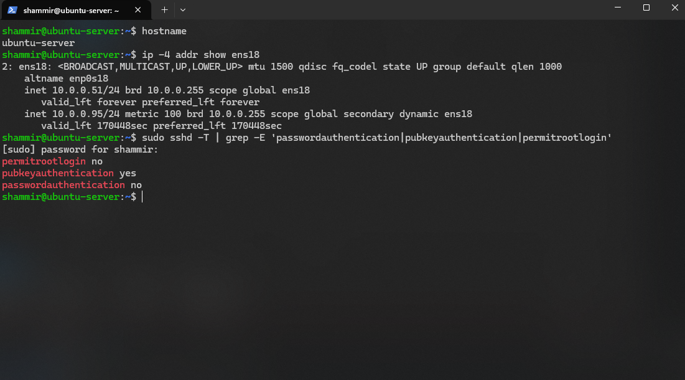
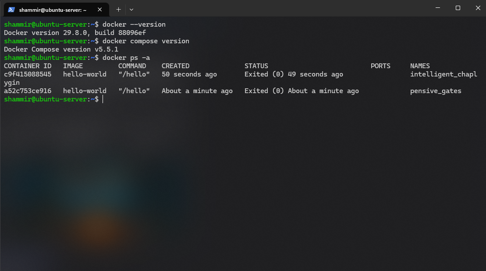
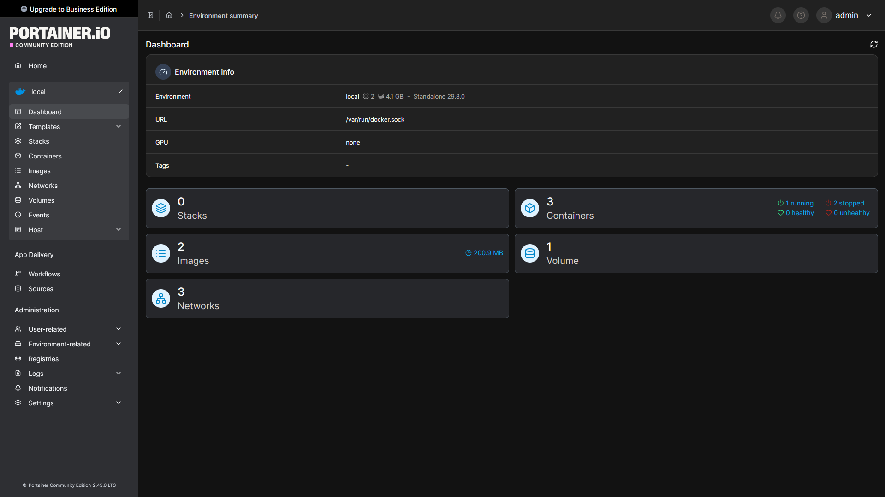
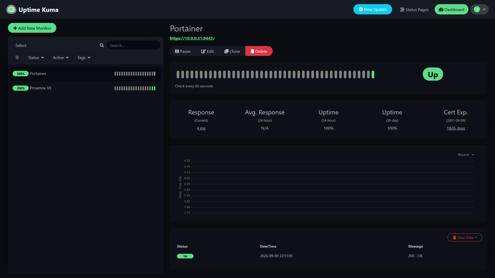

# Phase 2 — Linux Server

## Overview

The second phase of the home lab project focuses on deploying and configuring a Linux server that will host containerized applications and services.

An Ubuntu Server virtual machine was deployed on the Proxmox VE host. The VM is connected to the home LAN through the Proxmox Linux bridge and can be administered remotely using SSH.

## Ubuntu Server VM Deployment

Ubuntu Server was deployed as a virtual machine on the Proxmox VE host.

The VM was configured with the following networking environment:

| Setting           | Configuration   |
| ----------------- | --------------- |
| Operating System  | Ubuntu Server   |
| Hostname          | `ubuntu-server` |
| Hypervisor        | Proxmox VE      |
| Network Interface | `ens18`         |
| Proxmox Bridge    | `vmbr0`         |
| IPv4 Subnet       | `10.0.0.0/24`   |
| Default Gateway   | `10.0.0.1`      |
| Proxmox Host      | `10.0.0.50`     |
| Ubuntu Server     | `10.0.0.51`     |

The running Ubuntu Server VM can be viewed from the Proxmox VE management interface:



After installation, the server was successfully accessed remotely from a Windows workstation using SSH:

```bash
ssh shammir@10.0.0.51
```

## Static IP Configuration

The Ubuntu Server initially received the IPv4 address `10.0.0.95/24` dynamically through DHCP.

The active network interface was identified using:

```bash
ip addr
```

The routing table was inspected using:

```bash
ip route
```

This confirmed that the VM was using the `ens18` interface and the router at `10.0.0.1` as its default gateway.

Ubuntu Server uses Netplan for network configuration. The existing configuration was located at:

```text
/etc/netplan/50-cloud-init.yaml
```

The original configuration used DHCP:

```yaml
network:
  version: 2
  ethernets:
    ens18:
      dhcp4: true
```

The configuration was changed to assign the server the static IPv4 address `10.0.0.51/24`:

```yaml
network:
  version: 2
  ethernets:
    ens18:
      dhcp4: false
      addresses:
        - 10.0.0.51/24
      routes:
        - to: default
          via: 10.0.0.1
      nameservers:
        addresses:
          - 10.0.0.1
```

The new configuration was tested using:

```bash
sudo netplan try
```

Using `netplan try` allowed the network configuration to be temporarily applied before it was confirmed, reducing the risk of permanently losing remote SSH access because of an incorrect network configuration.

### Network Verification

The static address was verified with:

```bash
ip addr show ens18
```

The interface reported:

```text
inet 10.0.0.51/24
```

The routing table was checked to verify that traffic was routed through the LAN gateway:

```bash
ip route
```

Connectivity to the local gateway was tested with:

```bash
ping -c 4 10.0.0.1
```

Internet connectivity and DNS resolution were verified with:

```bash
ping -c 4 google.com
```

All connectivity tests completed successfully.

Remote administration was then tested from the Windows workstation using the server's new static address:

```powershell
ssh shammir@10.0.0.51
```

The Ubuntu Server VM is now consistently reachable at `10.0.0.51`.

## SSH Configuration

SSH was configured to provide secure remote administration of the Ubuntu Server VM from a Windows workstation.

The OpenSSH server was verified to be running using:

```bash
sudo systemctl status ssh
```

The server was also confirmed to be listening for SSH connections on TCP port `22`:

```bash
sudo ss -tlnp | grep :22
```

### SSH Key Authentication

An existing Ed25519 SSH key pair on the Windows workstation was used for authentication.

The public key was copied to the Ubuntu Server and stored in:

```text
/home/shammir/.ssh/authorized_keys
```

The `.ssh` directory and `authorized_keys` file were configured with appropriate permissions:

```text
~/.ssh                  700
~/.ssh/authorized_keys  600
```

After installing the public key, remote access was tested from Windows:

```powershell
ssh shammir@10.0.0.51
```

The connection succeeded without requiring the Ubuntu user's password, confirming that public-key authentication was working.

The private Ed25519 key remains on the Windows workstation and is never transferred to the server.

### SSH Hardening

SSH was hardened by disabling remote root login and password-based authentication while retaining public-key authentication.

During configuration, the effective SSH settings were inspected using:

```bash
sudo sshd -T | grep -E 'passwordauthentication|pubkeyauthentication|permitrootlogin'
```

Although `PasswordAuthentication no` had been configured in `/etc/ssh/sshd_config`, the effective configuration initially reported:

```text
passwordauthentication yes
```

Further investigation identified a cloud-init-generated configuration file:

```text
/etc/ssh/sshd_config.d/50-cloud-init.conf
```

containing:

```text
PasswordAuthentication yes
```

Because SSH configuration snippets are processed before later settings in the main configuration and the first obtained value is used, the cloud-init setting was taking precedence.

A dedicated hardening configuration was therefore created:

```text
/etc/ssh/sshd_config.d/00-hardening.conf
```

with:

```text
PasswordAuthentication no
PermitRootLogin no
PubkeyAuthentication yes
```

The configuration was validated before reloading the SSH service:

```bash
sudo sshd -t
```

The effective configuration was then verified:

```text
permitrootlogin no
pubkeyauthentication yes
passwordauthentication no
```

Finally, the SSH service was reloaded:

```bash
sudo systemctl reload ssh
```

### SSH and Network Verification

The final configuration confirms the server hostname, static IPv4 address, and hardened SSH authentication settings:



Public-key authentication was successfully tested from the Windows workstation:

```powershell
ssh shammir@10.0.0.51
```

Password-only authentication was then explicitly tested:

```powershell
ssh -o PreferredAuthentications=password -o PubkeyAuthentication=no shammir@10.0.0.51
```

The server rejected the connection:

```text
Permission denied (publickey).
```

This confirms that password authentication is disabled and remote administration requires possession of an authorized SSH private key.

## Docker Installation

Docker Engine was installed on the Ubuntu Server VM to provide the container runtime that will host services within the home lab.

Rather than using Ubuntu's `docker.io` package, Docker was installed using Docker's official APT repository. This provides packages maintained and distributed through Docker's repository.

### Docker Repository Configuration

The Ubuntu package index and existing packages were updated:

```bash id="khh9rx"
sudo apt update
sudo apt upgrade -y
```

The required repository dependencies were installed:

```bash id="f8g0pm"
sudo apt install ca-certificates curl -y
```

A directory was created for APT repository signing keys:

```bash id="d5cpwz"
sudo install -m 0755 -d /etc/apt/keyrings
```

Docker's official GPG signing key was downloaded:

```bash id="9uwmpc"
sudo curl -fsSL https://download.docker.com/linux/ubuntu/gpg \
  -o /etc/apt/keyrings/docker.asc
```

Read permissions were applied to the key:

```bash id="04hn19"
sudo chmod a+r /etc/apt/keyrings/docker.asc
```

Docker's official Ubuntu repository was then added to the system's APT sources:

```bash id="k2cbv6"
echo \
  "deb [arch=$(dpkg --print-architecture) signed-by=/etc/apt/keyrings/docker.asc] https://download.docker.com/linux/ubuntu \
  $(. /etc/os-release && echo "${UBUNTU_CODENAME:-$VERSION_CODENAME}") stable" | \
  sudo tee /etc/apt/sources.list.d/docker.list > /dev/null
```

The package index was refreshed to include packages from the newly configured repository:

```bash id="y7e6g5"
sudo apt update
```

### Docker Engine Installation

Docker Engine and the supporting Docker components were installed:

```bash id="5agjns"
sudo apt install docker-ce docker-ce-cli containerd.io docker-buildx-plugin docker-compose-plugin -y
```

This installation included:

- **Docker Engine (`docker-ce`)** — provides the Docker daemon responsible for managing containers.
- **Docker CLI (`docker-ce-cli`)** — provides the `docker` command-line interface.
- **containerd** — provides the underlying container runtime used by Docker.
- **Docker Buildx** — provides extended container image build functionality.
- **Docker Compose** — allows multi-container applications to be defined and managed using Compose files.

### Service Verification

The Docker service was verified using:

```bash id="j3tttr"
sudo systemctl status docker
```

Docker was confirmed to be running.

The service was also checked to ensure that Docker starts automatically when the Ubuntu Server boots:

```bash id="cm3iqj"
sudo systemctl is-enabled docker
```

The service reported:

```text id="0z68dy"
enabled
```

Docker Engine and Docker Compose were then verified:

```bash id="o65o5q"
docker --version
docker compose version
```

### Docker User Permissions

By default, communication with the Docker daemon requires elevated privileges.

The administrative user was added to the `docker` group:

```bash id="edtyfb"
sudo usermod -aG docker $USER
```

The SSH session was closed and re-established so that the new group membership would take effect.

Group membership was verified using:

```bash id="cl18bc"
groups
```

After this change, Docker commands could be executed without prefixing each command with `sudo`.

Membership in the `docker` group effectively provides root-level privileges through the Docker daemon. Access to this group should therefore only be provided to trusted administrative users.

### Container Verification

The Docker installation was tested by running the official `hello-world` container:

```bash id="x6d8ol"
docker run hello-world
```

Docker successfully:

1. Contacted the Docker daemon.
2. Pulled the `hello-world` image from Docker Hub.
3. Created a container from the downloaded image.
4. Executed the container.
5. Returned its output to the terminal.

The container returned:

```text id="4cbzd1"
Hello from Docker!
This message shows that your installation appears to be working correctly.
```

This confirmed that the Docker client, daemon, container runtime, network connectivity, image retrieval, and container execution were functioning correctly.

### Docker Verification

The final installation was inspected using:

```bash id="e6nkhz"
docker --version
docker compose version
docker ps -a
```



Docker Engine is now operational on the Ubuntu Server VM and ready to host containerized home lab services.

## Portainer Deployment

Portainer Community Edition was deployed as a Docker container to provide a web-based management interface for the Docker environment.

A persistent Docker volume was first created to store Portainer configuration and application data:

```bash
docker volume create portainer_data
```

Portainer was then deployed using the following Docker configuration:

```bash
docker run -d \
  -p 9443:9443 \
  --name portainer \
  --restart=always \
  -v /var/run/docker.sock:/var/run/docker.sock \
  -v portainer_data:/data \
  portainer/portainer-ce:lts
```

The deployment uses:

| Configuration          | Purpose                                                      |
| ---------------------- | ------------------------------------------------------------ |
| `9443:9443`            | Exposes the Portainer HTTPS web interface                    |
| `--restart=always`     | Automatically restarts Portainer with Docker                 |
| `/var/run/docker.sock` | Allows Portainer to communicate with the local Docker Engine |
| `portainer_data:/data` | Provides persistent storage for Portainer configuration      |

Portainer was accessed from another system on the LAN using:

```text
https://<ubuntu-server-ip>:9443
```

The initial administrator account was configured and Edge Compute features were skipped because Portainer is currently managing only the local Docker environment.

After setup, Portainer successfully detected the local Docker Engine through the Docker socket.



The Portainer dashboard confirmed access to the Docker host and its containers, images, networks, and volumes.

### Result

Portainer is now available as a graphical management interface for the Docker environment. Docker can be administered either through the Docker CLI over SSH or through the Portainer web interface.

This provides the foundation for deploying and managing additional containerized services within the home lab.

## Uptime Kuma Deployment

Uptime Kuma was deployed as a Docker container to provide service availability and uptime monitoring for the home lab.

A persistent Docker volume was created to store monitoring configuration, user data, and historical uptime information:

```bash
docker volume create uptime-kuma
```

Uptime Kuma was then deployed using:

```bash
docker run -d \
  --restart=always \
  -p 3001:3001 \
  -v uptime-kuma:/app/data \
  --name uptime-kuma \
  louislam/uptime-kuma:1
```

The deployment uses:

| Configuration           | Purpose                                                           |
| ----------------------- | ----------------------------------------------------------------- |
| `3001:3001`             | Exposes the Uptime Kuma web interface on port 3001                |
| `--restart=always`      | Automatically restarts Uptime Kuma with Docker                    |
| `uptime-kuma:/app/data` | Provides persistent storage for configuration and monitoring data |

Uptime Kuma was accessed from another system on the LAN using:

```text
http://<ubuntu-server-ip>:3001
```

After the initial administrator account was configured, monitors were created for existing home lab services.

| Monitor    | Address                  | Check Interval |
| ---------- | ------------------------ | -------------- |
| Proxmox VE | `https://10.0.0.50:8006` | 60 seconds     |
| Portainer  | `https://10.0.0.51:9443` | 60 seconds     |

Because Proxmox and Portainer currently use locally generated/self-signed TLS certificates, certificate verification was disabled for these internal monitoring checks.

Both services successfully reported an **Up** status.



The monitoring test also confirmed that the Uptime Kuma container can communicate with services running both on its Docker host and elsewhere on the local network.

### Result

Uptime Kuma now provides centralized availability monitoring for services within the home lab. Additional monitors can be added as new services are deployed.

The current Docker environment consists of:

- **Portainer** — Docker container management interface
- **Uptime Kuma** — Service availability and uptime monitoring

Both containers use persistent Docker volumes and are configured to automatically restart with the Docker Engine.

## Phase 2 Result

Phase 2 established a dedicated Linux server environment for hosting containerized home lab services.

The completed architecture is:

```text
Physical Server
└── Proxmox VE
    │
    └── Ubuntu Server VM
        │
        └── Docker Engine
            │
            ├── Portainer
            │   └── HTTPS :9443
            │
            └── Uptime Kuma
                └── HTTP :3001
```

The Ubuntu Server VM is configured with static network addressing and can be remotely administered over SSH using public-key authentication.

Docker Engine provides the container runtime for self-hosted applications, while Portainer provides graphical container management and Uptime Kuma provides service availability monitoring.

### Phase 2 Checklist

- [x] Deploy Ubuntu Server VM
- [x] Configure static addressing
- [x] Configure SSH
- [x] Install Docker
- [x] Deploy Portainer
- [x] Deploy Uptime Kuma

**Phase 2 — Linux Server complete.**
